# 2. 画面を作る

XojoはIDEであり、画面のコンポーネントをドラッグ&ドロップしつつ、コーディングをしてソフトウェアを開発していきます。そのため、最初に画面を作りつつ開発を進めていくことができます。

まず、今回作るアプリケーションの画面を作ってしまいましょう。

### コントローラを配置する

今回利用するコントローラは次の通りです。

- ラベル（Label）×4
- テキスト（Text Field）×3
- ボタン（Generic Button）×2
- 四角（Rectangle）×1

まず、これらの部品をWindow1に対してドラッグ&ドロップしていきます。

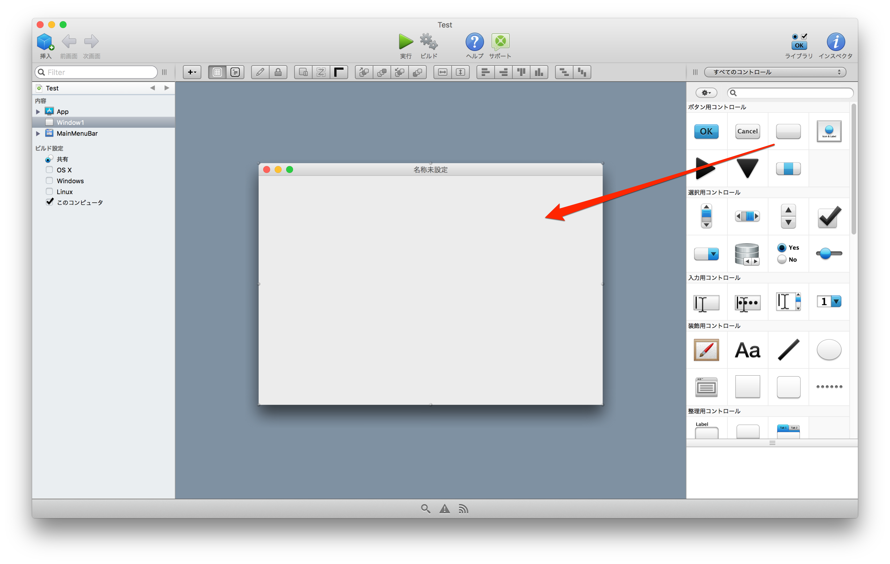

右上にあるライブラリをクリックすると、右側にコントロール一覧が表示されます。

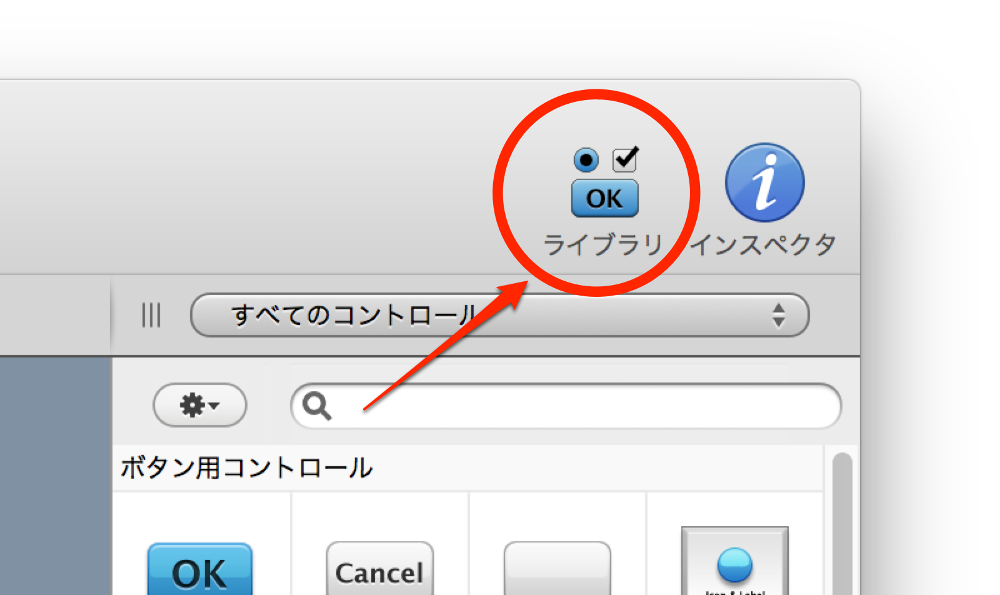

そして、その中にある部品をドラッグして、中央にあるウィンドウへドロップします。

コントロールが探せない場合は、右上の検索ボックスを使って絞り込めます。

コントロールを一つ配置したら、後はそのコントロールをコピー（Ctrl+Cまたはコマンド+C）&ペースト（Ctrl+Vまたはコマンド+V）で追加できます。もちろん再度ドラッグ&ドロップしても大丈夫です。

最終的に次のような配置になれば完了です。

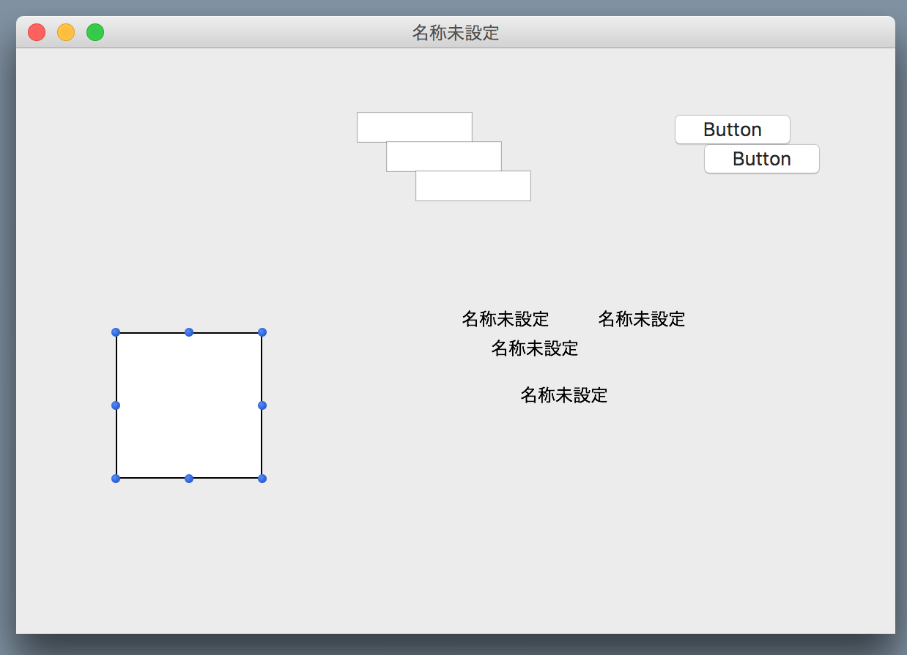

## 整形する

このままでは使い勝手がよくありませんのでコントロールを並び替えていきます。例として、3つのラベルを左側に配置します。

3つのラベルを選択します。

選択した状態で、上のツールバー部分にあるアイコンで、左揃えをクリックします。

そうすると選択したコントロールが左揃えになります。

後はまとめてドラッグしてウィンドウ上の好きな場所に配置します。

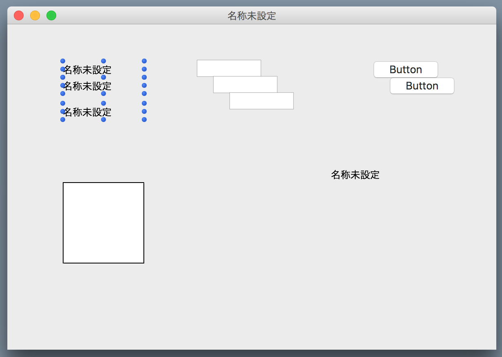

これで左右の場所は良くなりましたが、上下の間隔が揃っていません。続けて縦方向に並べるボタンをクリックします。

そうすると各コントロールの間隔が揃います。この時の基準は一番上と一番下のコントロールになるので、適当に調整してください。

## 重なりを調整する

今回、四角（Rectangle）とラベルが重なっている箇所があります。配置した順番によっては四角が上になってしまうかも知れません。

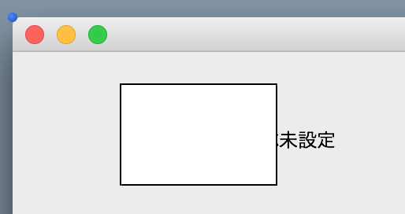

そうした時には重なっているコントロールを選択し、ツールバーの最背面に移動（または背面に移動）をクリックします。

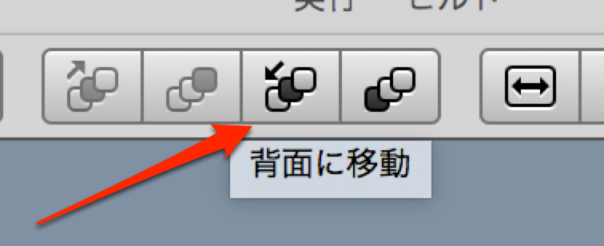

そうすると次のようにラベルが前に表示されます。

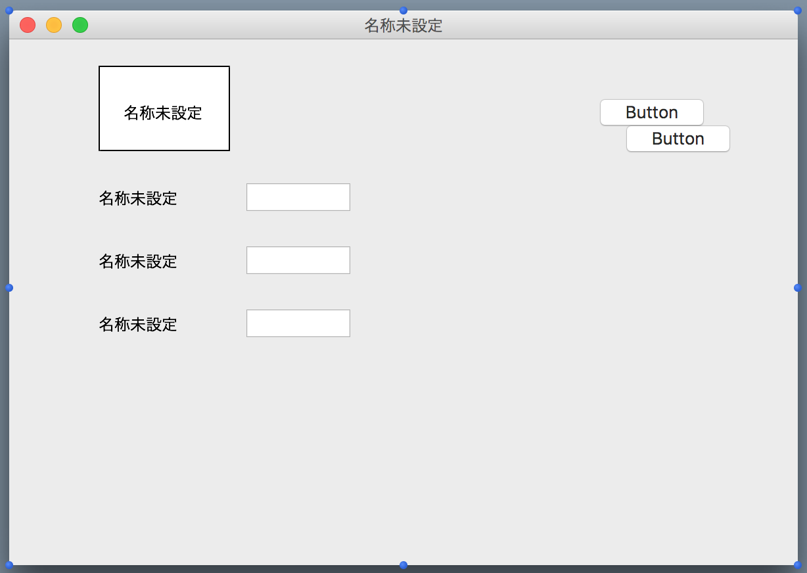

## コントローラの大きさを変える

コントロールの大きさを変える時は、まずコントローラを選択します。そうすると8個のマーカーが表示されます。

後はマーカーをドラッグして移動するとコントロールの大きさが変更できます。

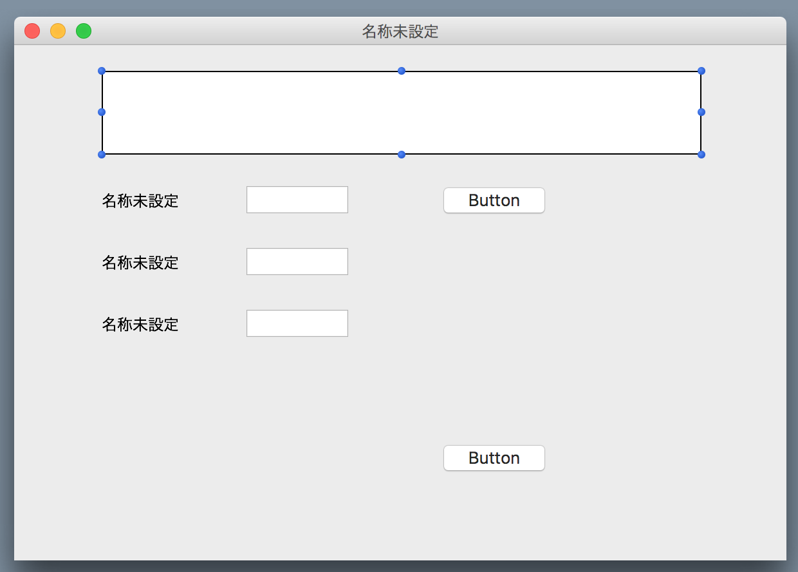

なお、コントロールを複数選択（Shiftキーを押しながら選択、またはドラッグで範囲選択）すると、まとめてサイズの調整ができます。

## コントロールの文字を変える

現在、各コントローラの文字はデフォルトのままとなっています。これを変更するにはコントローラを選択し、右下に表示される鉛筆アイコンをクリックします。

そうするとテキスト入力を行うツールチップが出ますので好きな文字を入力します。

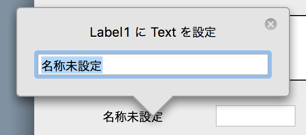

最後にエンターキーを押すと画面に反映されます。

## コントールのフォントサイズを変える

今回、画面の上にあるラベルは大きめ、太字となっています。そこで、まずラベルを選択します。

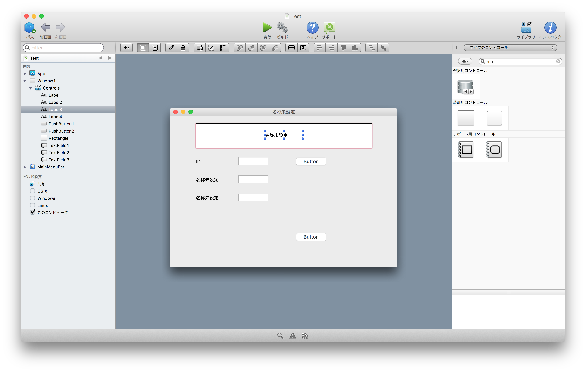

そして、画面の右上にあるインスペクタをクリックします。そうするとコントロールの一覧から、選択しているコントロールの設定変更になります。

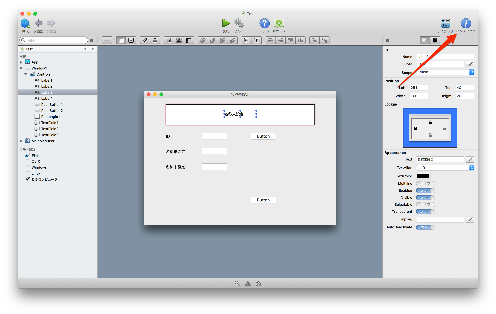

さらに右側のギアアイコン（矢印のところ）をクリックするとフォントサイズやフォントの装飾を変更できます。

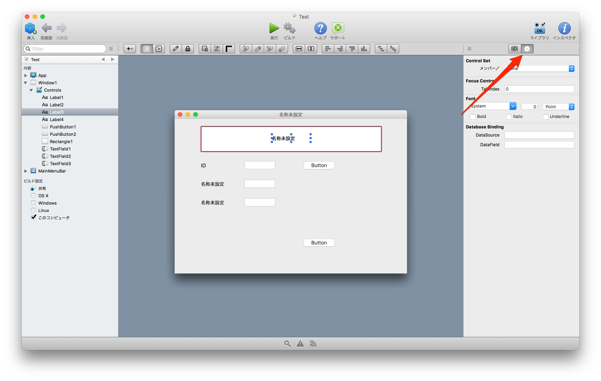

後は自由にフォントを大きくしたり、テキスト配置を変更して調整します。テキスト配置はTextAlignの設定で変更できます。

## 最終画面の確認

これらの方法を組み合わせることで、最終的に次のような画面になれば完了です。

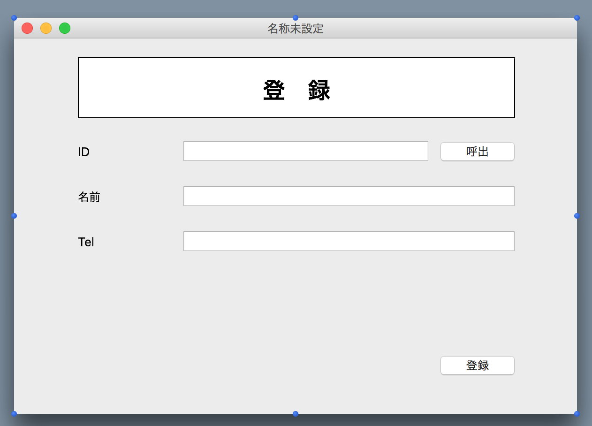

----

では続いて[実行してみる&開発の準備](3.md)に進んでください。
