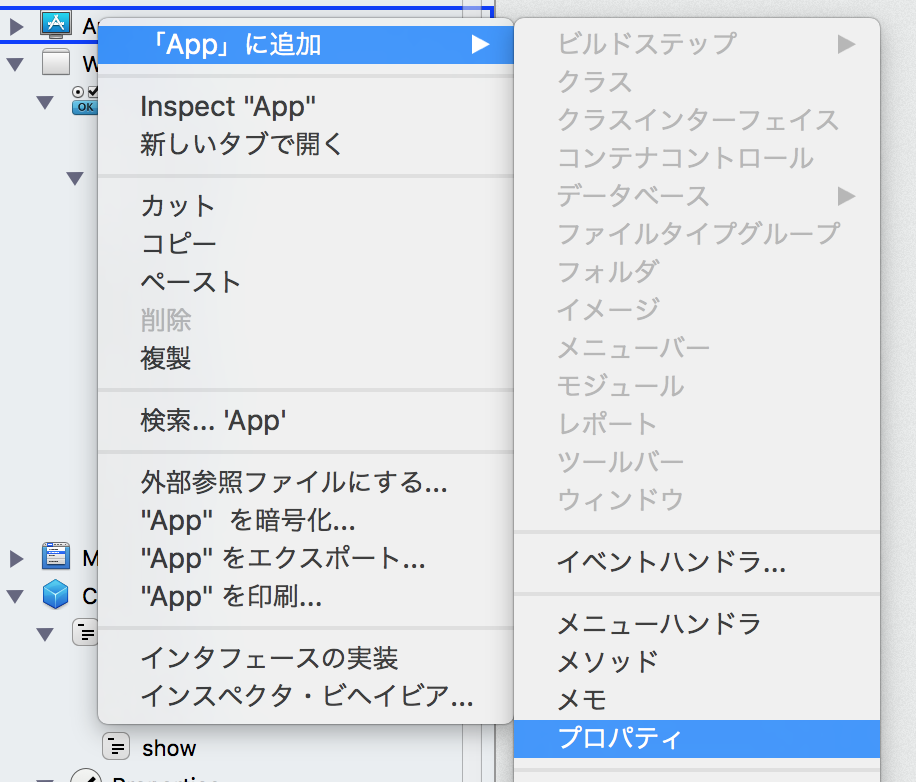

# データベースに接続する

今回はXojoからデータベースに接続する方法を紹介します。今回はSQLite3を使いますが、ActiveRecordを使いますのでデータベースの違いを意識することは殆どなく、MySQLやPostgreSQL、Oracle、SQL Server、ODBC経由での接続が行えます。

## Appにプロパティを追加する

通常、データベース接続はアプリケーション全体で共有されます。そこで、アプリケーション（App）オブジェクトの下にプロパティとしてデータベースを追加します。

まず App オブジェクトを右クリックして、 **「Appに追加」 > プロパティ** を選択します。2つプロパティを追加してください。

 
 
追加したら、それぞれインスペクタで次のように変更してください。スコープはいずれもPublicとします。

|名前|データ型|標準値|
|:-----|:-----|:-----|
|DB|SQLiteDatabase|&nbsp;|
|isConnect|Boolean|False|

## ウィンドウにメソッドを追加する

次にメソッドの追加ですが、これは Window1 に追加します。AppではまだDBの準備ができていないためです。ウィンドウを開いた時に処理を行って欲しいので、 Window1のConstructor として追加します。他と同じようにWindow1を右クリックして、メソッドを選択します。そして、インスペクタのところで Constructor を選択してください。

Window1.Constructor の内容に次のように記述してみましょう。Super.Constructorの記述は残しておいてください。

```
// Calling the overridden superclass constructor.
Super.Constructor
System.DebugLog("起動しました")
```

そしてアプリケーションを実行して、ログに「起動しました」と出ていればOKです。

## データベースに接続する

ではデータベースに接続する処理を作っていきます。これは Window1.Constructor 内に実装していきます。まずコメントで紹介します。

```
// ファイル名

// ファイルをセットする

// ファイルの存在チェック（最初の実行）

    // ファイルがなければ作成
  
    // ファイルがあれば開く

// 接続完了のフラグを立てる
  
// スキーマを実行
```

### ファイル名

ファイル名は任意ですが、今回は customer_management.sqlite とします。

```
// ファイル名
Dim filename as String = "customer_management.sqlite"
```

### ファイルをセットする

ファイルを定義します。ファイルの場所は任意ですが、今回はデスクトップに配置します。

さらに App.DB に対してファイルをセットします。

```
// ファイルをセットする
Dim dbFile As FolderItem = SpecialFolder.Desktop.Child(filename)

App.DB = New SQLiteDatabase
App.DB.DatabaseFile = dbFile
```

### ファイルの存在チェック

ファイルの存在チェック `dbFile.Exists` を使います。コードは次のようになります。

```
// ファイルの存在チェック（最初の実行）
if dbFile.Exists = False then
  // ファイルがなければ作成
else
  // ファイルがあれば開く
end if
```

### ファイルがない場合（最初の実行時）の処理

ファイルがない場合は作成します。ファイルの作成が失敗した場合はエラーメッセージを出して、アプリケーションを終了することにします。

```
// ファイルがなければ作成
if App.DB.CreateDatabaseFile = false then
        MsgBox "データベースが作成できませんでした"
        Quit
end if
```

### ファイルがある場合の処理

2回目以降の起動ではすでにファイルが存在しますので、それを開くようにします。こちらもファイルが開けなかった場合はエラーメッセージを出して終了します。

```
// ファイルがあれば開く
if App.DB.Connect = False then
      MsgBox "データベースが開けませんでした"
      Quit
end if
```

### 接続完了のフラグを立てる

ここまでの処理でデータベースが扱えない場合はアプリケーションを終了するようにしてきました。そのため、この行まできた場合はデータベースが扱える状態になっているはずです。そのフラグを立てておきます。今後はこのフラグを見て処理判定を行っていきます。

```
// 接続完了のフラグを立てる
App.isConnect = true
```

### スキーマを実行

データベースが開いたらスキーマを実行します。これは Customer クラスの loadSchema を使います。

```
// スキーマを実行
if Customer.loadSchema = false then
    MsgBox "テーブル作成に失敗しました"
    Quit
end if
```

続いて `Customer.loadSchema` を実装していくのですが、定義先にジャンプする際にはメソッドを右クリックして `Customer.loadSchema へ移動` を選択すると便利です。


ここまでの実装を確認すると次のようになります。

```
  // Calling the overridden superclass constructor.
  Super.Constructor
  
  // ファイル名
  Dim filename as String = "customer_management.sqlite"
  
  // ファイルをセットする
  Dim dbFile As FolderItem = SpecialFolder.Desktop.Child(filename)
  
  App.DB = New SQLiteDatabase
  App.DB.DatabaseFile = dbFile
  
  // ファイルの存在チェック（最初の実行）
  if dbFile.Exists = False then
    // ファイルがなければ作成
    if App.DB.CreateDatabaseFile = false then
      MsgBox "データベースが作成できませんでした"
      Quit
    end if
  else
    // ファイルがあれば開く
    if App.DB.Connect = false then
      MsgBox "データベースが開けませんでした"
      Quit
    end if
  end if
  
  // 接続完了のフラグを立てる
  App.isConnect = true
  
  // スキーマを実行
  if Customer.loadSchema = false then
    MsgBox "テーブル作成に失敗しました"
    Quit
  end if
```

## Customer.loadSchemaの実装

では `Customer.loadSchema` を実装していきます。まずはコメントで確認します。

```
// SQLの定義
  
// DB接続確認
  
// SQL実行
  
// SQLエラーの確認
  
// 完了
```

### SQLの定義

SQLは次のようになります。起動する度に実行されるのでテーブルの存在チェックも行います。

印刷の関係上、細かく折り返していますが一行で記載することも可能です。処理が複数行にわたる場合は _（アンダースコア）で折り返せます。

```
// SQLの定義
Dim sql As String
sql = "CREATE TABLE IF NOT EXISTS " + _
         "customers (id INTEGER NOT NULL, " + _
         "name TEXT, tel TEXT, PRIMARY KEY(id));"  
```

テーブルの定義は次のようになります。プライマリキーはidです。

|カラム名|型|
|:-----------|:-----------|
|id|Integer|
|name|Text|
|tel|Text|

### DB接続確認

データベースの接続確認は先ほど定義した `App.isConnect` を使います。接続していない場合は false を返して終了です。

```
// DB接続確認
If App.isConnect = false Then
  return false
end if
```

### SQL実行

実際にSQLを実行します。

```
App.DB.SQLExecute(sql)
```

### SQLエラーの確認

SQLを実行した後、エラーを確認します。エラーの場合は falseを返します。

```
If App.DB.Error Then
  System.DebugLog("DB Execute Error")
  return false
end if  
```

### 完了

エラーがない場合は true を返します。

```
// 完了
return true
```

### 全体のコード

Customer.loadSchemaのコードは次のようになります。動かない場合は参照してください。

```
  // SQLの定義
  Dim sql As String
  sql = "CREATE TABLE IF NOT EXISTS " + _
         "customers (id INTEGER NOT NULL, " + _
         "name TEXT, tel TEXT, PRIMARY KEY(id));"  
  
  // DB接続確認
  If App.isConnect = false Then
    return false
  end if
  
  // SQL実行
  App.DB.SQLExecute(sql)
  
  // SQLエラーの確認
  If App.DB.Error Then
    System.DebugLog("DB Execute Error")
    return false
  end if
  
  // 完了
  return true
```

----

ここまでの実装が終わってアプリを実行すると、デスクトップに `customer_management.sqlite` をいうファイルが生成されます。サイズは 2,048 byte 程度で、customers テーブルの定義だけが書かれています。

では続いてデータを保存する処理を作っていきます。 [データを保存する](8.md)へ進んでください。
