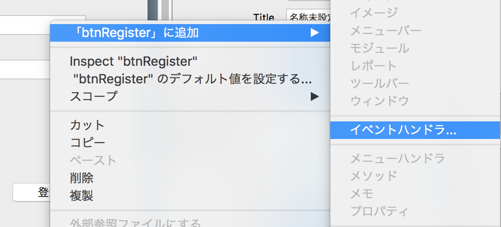

# データを保存する

続いてデータを登録する処理を作っていきたいと思います。これは登録ボタンを押したイベントで作ります。

## イベントの作成

登録ボタンを右クリックして、イベントハンドラでActionを追加してください。




## コードを書く

まずコメントで紹介します。

```
  // IDを取得
  
  // カスタマーオブジェクトの作成
  
  // オブジェクトに値を設定
  
  // 保存実行
    // 保存成功
    
    // 保存失敗 
```


### IDを取得

Xojoでは入力欄の取り方が幾つかあります。

1. txtId.Text
2. Self.txtId.Text
3. Window1.txtId.Text

このいずれでも取れますが、Selfを使うのがお勧めです。1では簡略化しすぎていて、どこで定義されているものかが分かりづらいでしょう。3は長いため、他のウィンドウを操作する時にすべきです。Text FieldはString型なので、Val関数を使って数値に変換します。

```
  // IDを取得
  Dim id as integer
  id = Val(Self.txtId.Text)
```

### カスタマーオブジェクトの作成

カスタマーオブジェクトの作成は次のようになります。変数の定義はDimを使い、変数の定義と同時にクラスのインスタンスを定義します。引数のidはカスタマーIDになります。

```
  // カスタマーオブジェクトの作成
  Dim customer as new Customer(id)
```

### オブジェクトに値を設定

customerオブジェクトに値を設定します。これはText Fieldの値をそれぞれ入れるだけです。

```
// オブジェクトに値を設定
customer.name = Self.txtName.Text
customer.tel      = Self.txtTel.Text
```

### 保存実行

保存処理を実行します。これはCustomerクラスに定義したsaveDataメソッドを使います。saveData自体は後ほど実装します。

```
  if customer.saveData then
    // 保存成功
    MsgBox "保存しました"
  else
    // 保存失敗
    MsgBox "保存失敗しました"
  end if
```

### btnRegister.Actionの内容

ここまでの処理全体は次のようになります。

```
  // IDを取得
  Dim id as integer
  id = Val(Self.txtId.Text)
  
  // カスタマーオブジェクトの作成
  Dim customer as new Customer(id)
  
  // オブジェクトに値を設定
  customer.name = Self.txtName.Text
  customer.tel      = Self.txtTel.Text
  
  // 保存実行
  if customer.saveData then
    // 保存成功
    MsgBox "保存しました"
  else
    // 保存失敗
    MsgBox "保存失敗しました"
  end if
```

## Customer.saveData の実装

続いて Customer.saveData を実装します。コメントでは次のようになります。

```
  // 行オブジェクトの定義

  // 行のデータを設定
  
  // データの追加処理
  
  // SQLエラーの確認
  
  // 完了
```

### 行オブジェクトの定義

行オブジェクトは DatabaseRecord になります。

```
// 行オブジェクトの定義
Dim row As New DatabaseRecord
```

### 行のデータを設定

行のデータはクラスのプロパティを使います。カラムにはテキストしか設定できないため、idはToTextを使って文字列に変換しています。

```
  row.Column("id") = self.id.ToText
  row.Column("name") = self.name
  row.Column("tel") = self.tel
```

### データの追加処理

データの追加処理を実行します。

```
  // データの追加処理
  App.DB.InsertRecord("customers", row)
```

### SQLエラーの確認&完了

後はSQLがエラーを出していないかを確認し、完了となります。

```
  // SQLエラーの確認
  If App.DB.Error Then
    System.DebugLog("DB Execute error")
    return false
  end if
  
  // 完了
  return true
```

### Customer.saveData の内容

実装した内容は次の通りです。

```
  // 行オブジェクトの定義
  Dim row As New DatabaseRecord
  
  // 行のデータを設定
  row.Column("id") = self.id.ToText
  row.Column("name") = self.name
  row.Column("tel") = self.tel
  
  // データの追加処理
  App.DB.InsertRecord("customers", row)
  
  // SQLエラーの確認
  If App.DB.Error Then
    System.DebugLog("DB Execute error")
    return false
  end if
  
  // 完了
  return true
```

### Customer.Constractorの実装

最後に Customer.Constractor の実装を行います。これは new した時の引数である id をクラスのプロパティに入れるだけです。

```
// IDを入れる
self.id = id
```

## 確認する

実際にアプリケーションを動かして動作を確認してみましょう。データを入力していきます。


そして登録ボタンを押すと、保存しましたというダイアログが出るはずです。


----

今回でデータの保存処理まで完了しました。次回は保存したデータを呼び出す処理を作ります。[データを読み込む](9.md)に進んでください。
